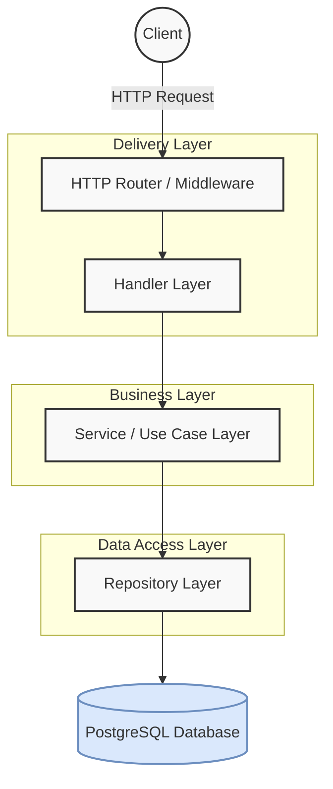

# 🚗 SpotSync - Smart Parking & EV Charging Reservation

<div align="center">
  
  
  
  
  
  
</div>

<br />

> A centralized platform for busy airports and malls to manage parking zones, specifically handling the high-demand reservation of limited EV charging spots.

**Live URL:** [https://spotsync-api-dq4j.onrender.com/](https://spotsync-api-dq4j.onrender.com/)

## ✨ Features

- **Robust Authentication:** Secure JWT-based authentication using `bcrypt` for password hashing.
- **Role-Based Access Control (RBAC):** Distinct `driver` and `admin` roles with specific permissions.
- **Concurrency-Safe Reservations:** Implements GORM Database Transactions and Row-Level Locking (`FOR UPDATE`) to prevent race conditions and overbooking (the "EV Spot Bottleneck" problem).
- **Soft Deletes:** Implements safe data retention strategies by utilizing GORM's automatic soft deletion.
- **Domain-Driven Design (DDD):** Clean, modular architecture separating layers (Delivery/HTTP, Use Case/Service, Domain, Repository).
- **Dynamic Capacity Calculation:** Real-time tracking of available parking spots based on active reservations.

## 🛠️ Technology Stack

- **Language:** Go (Golang) v1.26
- **Web Framework:** Echo v5 (`github.com/labstack/echo/v5`)
- **ORM:** GORM (`gorm.io/gorm`)
- **Database:** PostgreSQL (NeonDB / Supabase)
- **Validation:** Go Playground Validator (`github.com/go-playground/validator/v10`)
- **Authentication:** JWT (`github.com/golang-jwt/jwt/v5`)
- **Deployment:** Docker & Render

## 🏗️ Architecture

SpotSync follows a Domain-Driven Design (DDD) inspired layered architecture to ensure separation of concerns, scalability, and testability.



**How layers interact:**
1. **Router & Middleware:** Intercepts the request, enforces JWT authentication, role-based checks, and logs the request.
2. **Handler (Delivery):** Parses incoming JSON to DTOs (Data Transfer Objects), validates the data using the Go Playground Validator, and passes it to the Service layer.
3. **Service (Business Logic):** Contains the core business rules. It enforces domain logic (e.g., checking if a parking zone has capacity) and orchestrates data fetching/saving.
4. **Repository (Data Access):** Directly interacts with the PostgreSQL database using GORM. It abstracts SQL queries away from the business logic.

## 📋 Prerequisites

Before you begin, ensure you have met the following requirements:
- Go 1.22+ installed (if running natively).
- Docker and Docker Compose installed (recommended).
- `make` installed (for running Makefile commands).

## 🚀 Getting Started (Setup Steps)

### 1. Clone the repository

```bash
git clone https://github.com/Al-mizan/spot-sync.git
cd spot-sync
```

### 2. Set up environment variables

Copy the example environment file and configure it:

```bash
cp .env.example .env
```

Ensure your `.env` looks like this:
```env
# Use 'host=localhost' if running natively, or 'host=db' if using docker-compose
DSN="host=localhost user=postgres password=postgres dbname=spotsync port=5432 sslmode=disable TimeZone=Asia/Dhaka"
PORT=8080
JWT_SECRET=your_jwt_secret_key
ENVIRONMENT=development
```

### 3. Run the application

**Option A: Using Docker (Recommended)**
```bash
# Starts the Go API and a local PostgreSQL instance
docker compose -f docker-compose.dev.yaml up -d
```

**Option B: Native Go**
Make sure you have a PostgreSQL instance running locally.
```bash
# Run the app locally
make run

# Build the executable
make build
```

## 🌐 API Endpoint List

**Base URL:** `https://spotsync-api-dq4j.onrender.com`

### Authentication (`/api/v1/auth`)
| Method | Endpoint | Description | Body | Auth Required |
| :--- | :--- | :--- | :--- | :--- |
| `POST` | `/register` | Register a new user | `{"name": "...", "email": "...", "password": "...", "role": "driver"}` | No |
| `POST` | `/login` | Login and get JWT | `{"email": "...", "password": "..."}` | No |

### Parking Zones (`/api/v1/zones`)
| Method | Endpoint | Description | Body | Auth Required |
| :--- | :--- | :--- | :--- | :--- |
| `GET` | `/` | List all parking zones | None | No |
| `GET` | `/:id` | Get zone by ID | None | No |
| `POST` | `/` | Create a new zone | `{"name": "...", "type": "general", "total_capacity": 50, "price_per_hour": 15.5}` | Yes (Admin) |
| `PATCH` | `/:id` | Update a zone | `{"total_capacity": 60}` (all fields optional) | Yes (Admin) |
| `DELETE` | `/:id` | Soft delete a zone | None | Yes (Admin) |

### Reservations (`/api/v1/reservations`)
| Method | Endpoint | Description | Body | Auth Required |
| :--- | :--- | :--- | :--- | :--- |
| `POST` | `/` | Reserve a spot | `{"zone_id": 1, "license_plate": "ABC-1234"}` | Yes |
| `GET` | `/my-reservations` | View your reservations | None | Yes |
| `DELETE` | `/:id` | Cancel your reservation | None | Yes |
| `GET` | `/` | View all reservations | None | Yes (Admin) |

## 📁 Project Structure

```text
.
├── cmd/                # Main application entry point (main.go)
├── internal/           # Private application and library code
│   ├── apperror/       # Custom application error definitions
│   ├── auth/           # Authentication utilities (JWT, password hashing)
│   ├── config/         # Environment variables and configuration loading
│   ├── ctxkeys/        # Context keys for Echo middleware
│   ├── domain/         # Core business logic and entities (user, zone, reservation)
│   ├── httpresponse/   # Standardized HTTP response wrappers
│   ├── middlewares/    # Echo middlewares (auth, logging, roles)
│   └── server/         # Server initialization and routing
├── Makefile            # Build and development scripts
├── Dockerfile.dev      # Dockerfile for local development
├── Dockerfile.prod     # Multi-stage Dockerfile for production
├── docker-compose.*    # Docker compose configurations
├── .env.example        # Example environment variables
└── go.mod              # Go module dependencies
```

## 🔒 Security & Concurrency

SpotSync places a strong emphasis on data integrity and security:
- **Transaction Locks:** When a reservation is created, the system locks the specific parking zone row to verify capacity dynamically before inserting the reservation. This completely eliminates race conditions where multiple users try to book the last available spot simultaneously.
- **Data Protection:** Passwords are never logged or returned in API responses.

## 📄 License

This project is licensed under the MIT License. See the `LICENSE` file for more details.
